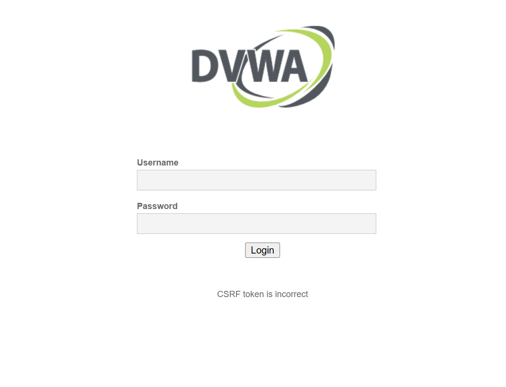
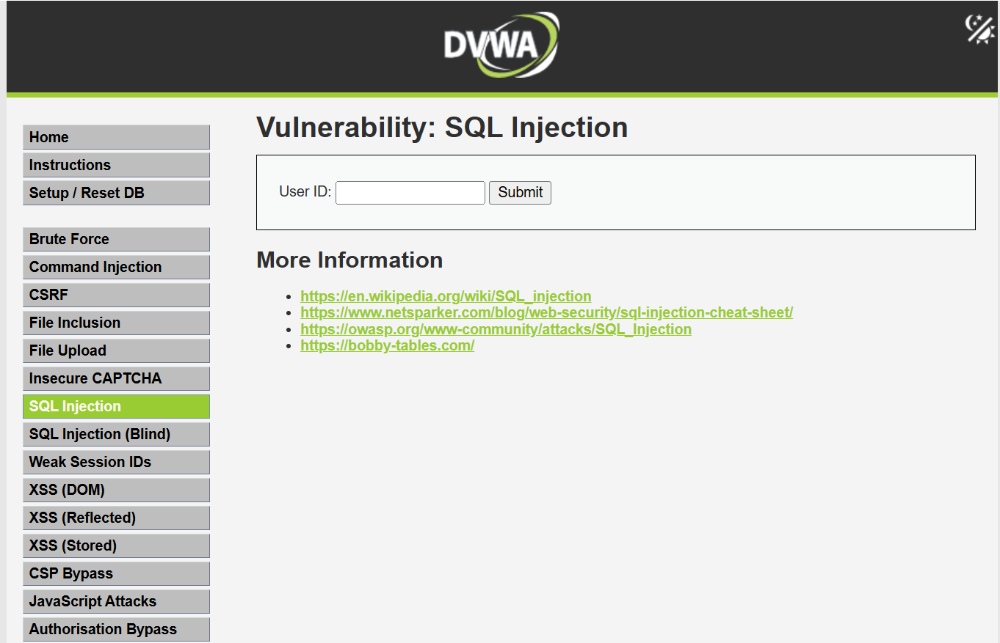
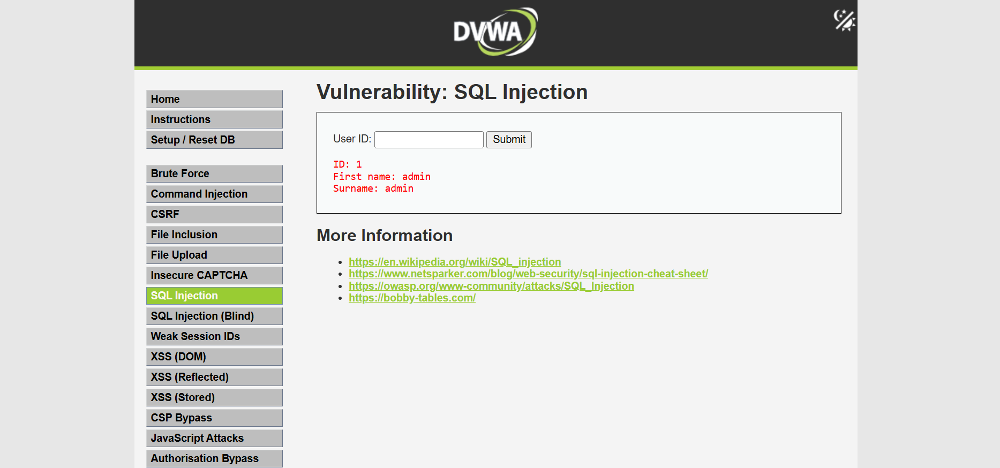
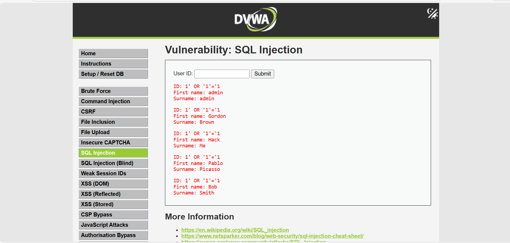

# SQL Injection Vulnerability Report (DVWA)

## 📖 Project Overview

This project demonstrates a simple SQL Injection vulnerability using 
Damn Vulnerable Web Application (DVWA).

DVWA is an intentionally vulnerable web application used for learning and 
practicing web security concepts in a safe lab environment.

This project was performed in a controlled local environment for educational purposes only.

---

## 🔍 Vulnerability Name

SQL Injection (Low Security Level)

---

## 🧠 Vulnerability Overview

SQL Injection is a web security vulnerability that allows an attacker 
to interfere with database queries by injecting malicious SQL code 
into input fields.

In this case, the application does not properly validate user input 
before sending it to the database.

---

## 💥 Impact (Simple Explanation)

If exploited by an attacker:

- All user data from the database can be accessed.
- Sensitive information can be exposed.
- Authentication bypass may be possible.
- The entire database could be compromised.

This can lead to serious data breaches.

---

---

## 🔬 Research & Testing Methodology

- Testing Type: Manual Testing
- Environment: Localhost (XAMPP)
- DVWA Security Level: Low
- Attack Method: Input manipulation
- No automated exploitation tools were used

## 🧪 Proof of Concept (PoC)

### Step 1:
Start XAMPP and open DVWA:
http://localhost/DVWA

### Step 2:
Login using default credentials:
- Username: admin
- Password: password

### Step 3:
Set Security Level to **Low**

### Step 4:
Go to:
DVWA Security → SQL Injection

### Step 5:
Enter normal input:
1
Result: Shows single user record.

### Step 6:
Enter malicious input:
1' OR '1'='1

Result: All user records are displayed.

This proves the application is vulnerable to SQL Injection.

---
---

## 📊 Risk & Severity Classification

- Vulnerability Type: SQL Injection
- Severity Level: High
- Risk Impact: Unauthorized data access
- OWASP Category: Injection (OWASP Top 10)

Reason:
The vulnerability allows attackers to extract entire database records without authentication control.

## 🖥️ Screenshots

### 1️⃣ DVWA Login Page

### 2️⃣ SQL Injection Vulnerability Page

### 3️⃣ Normal Query Result (ID = 1)

### 4️⃣ SQL Injection Result (Multiple Users Retrieved)
Payload Used:

1' OR '1'='1

---

## 🛠 Basic Fix & Prevention

To prevent SQL Injection:

1. Use Prepared Statements (Parameterized Queries)
2. Validate and sanitize user input
3. Use least privilege database access
4. Enable proper error handling

---

## 🏷 Tools Used

- DVWA (Damn Vulnerable Web Application)
- XAMPP (Apache + MySQL)
- PHP
- Localhost Environment

---

## ⚠ Disclaimer

This project was performed in a controlled lab environment 
for educational and learning purposes only.

## 🏢 Internship Context

This project was completed as part of my Cybersecurity Internship at Cryptonic Area.

The objective was to develop a security researcher mindset by:
- Identifying vulnerabilities
- Analyzing risk & impact
- Creating proof-of-concept documentation
- Suggesting remediation strategies

This project strengthened my understanding of both offensive and defensive security concepts.

